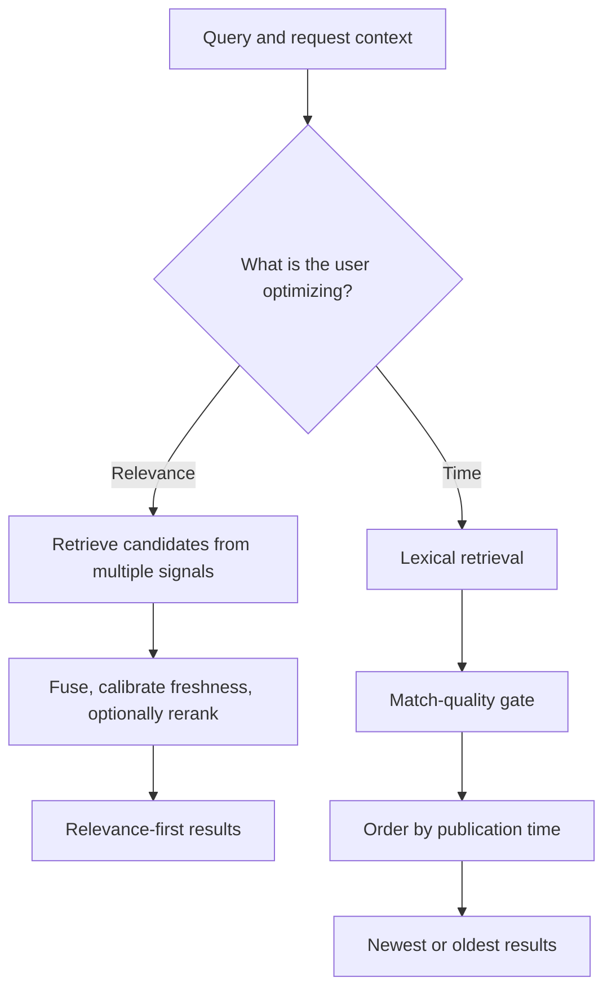
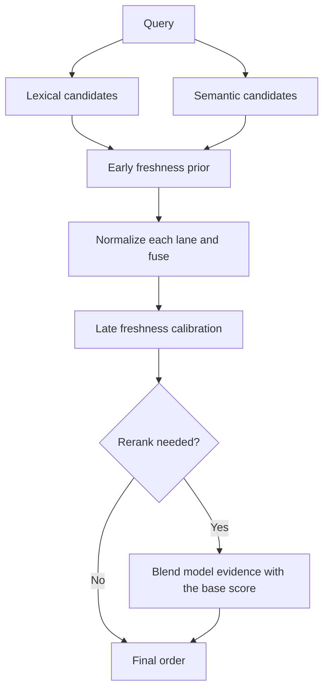
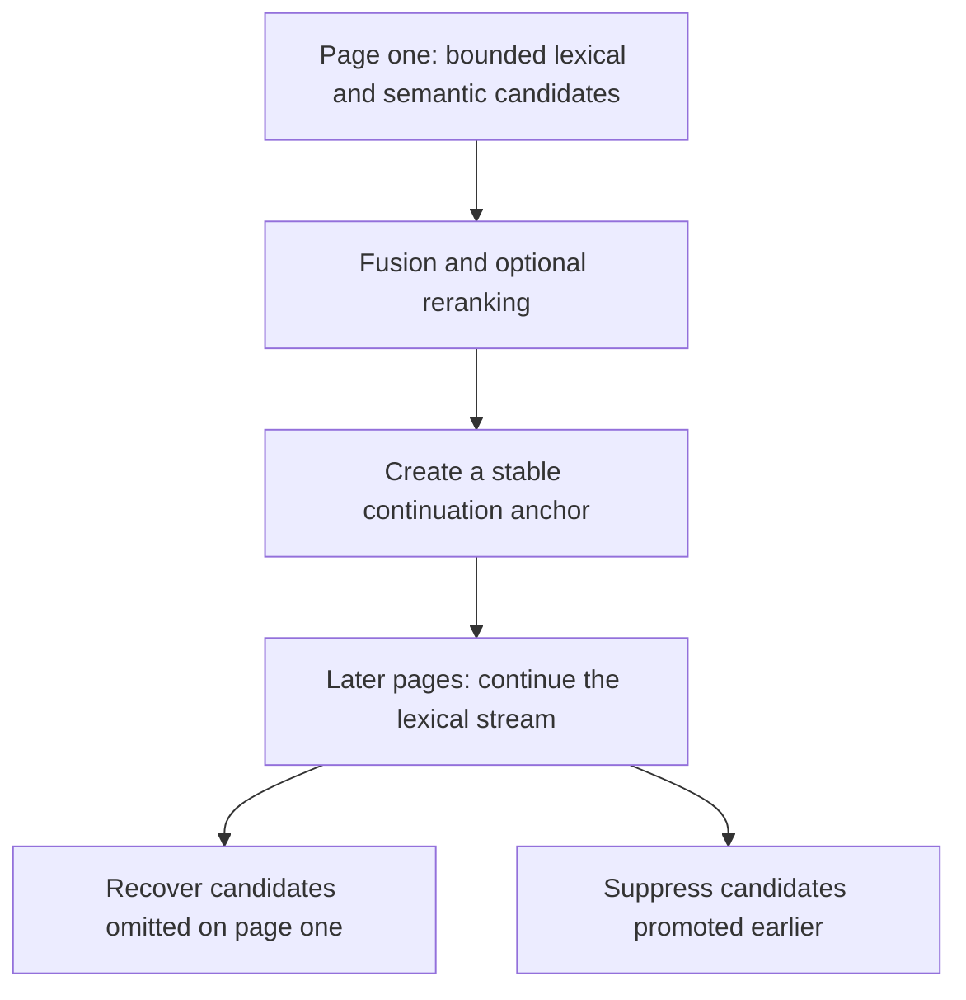
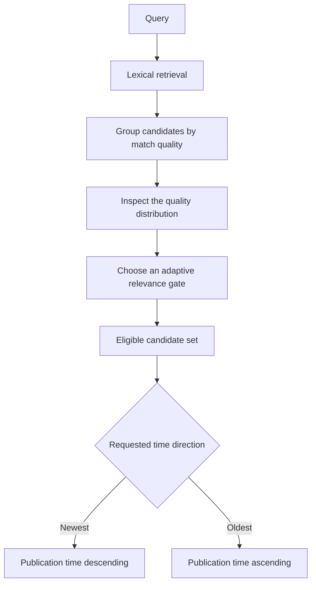

A production search engine is not a scoring formula with an API around it. It is a sequence of decisions: what the user is optimizing for, which documents are allowed to compete, where freshness belongs, when an expensive model is justified, and how page two can continue after page one has been rearranged.

This article presents a reusable model for that sequence. It deliberately stays above any one implementation: the interesting engineering ideas are the boundaries between stages, not a particular threshold, dictionary, or weight.

<!-- more -->

> [阅读中文版](/posts/multi-stage-search-ranking-zh)

## Choose the Objective Before the Algorithm

The same query box can express two different retrieval objectives:

- **Relevance-first:** show the documents that best satisfy the intent.
- **Time-first:** among documents that satisfy the intent, show the newest or
  oldest ones.

These are not merely two final sort keys over one candidate set. A
relevance-first path can let lexical retrieval, semantic retrieval, freshness,
and reranking reshape the order. A chronological path must first establish a
relevance boundary, then make publication time dominant.

If this decision is postponed until the end, the pipeline becomes difficult to
reason about. A newly published weak match can outrank a strong match, or a
relevance model can quietly undo the chronological promise. The objective has
to be selected before the algorithm.

## Two Ranking Paths at a Glance

The durable abstraction is the responsibility of each path:

- The relevance path compares candidates discovered in different ways.
- The chronological path compares time only after candidates are relevant
  enough to qualify.

Retrieval models will change. These responsibilities should remain explicit.

## Query Complexity Is a Policy Signal, Not a Length Switch

**Question: Is a query “complex” once it crosses a word-count boundary?**

Not in a robust design. Length can be useful, but complexity is better treated
as a **ranking-policy signal** assembled from several observations:

1. **Script and character shape.** Word boundaries are not equally visible in
   every writing system, and whitespace is not a universal tokenizer.
2. **Descriptive breadth.** A query that combines an event, location, actor, and
   relationship is different from a direct lookup.
3. **Known-entity exceptions.** A long organization name or fixed expression
   can still carry a simple navigational intent.

This classification can select a more suitable fusion, freshness, or reranking
policy. It should not, by itself, dictate the retrieval route. A known
navigational pattern, a lexical override, or a user-selected retrieval mode may
still change which candidate sources actually run.

Keeping those decisions separate prevents one boolean from accumulating every
special case in the system. “What kind of intent is this?” and “Which route
should execute?” are related questions, not the same question.

## The Relevance Path: From Candidates to Final Order

Ranking starts with candidate availability. Lexical retrieval is strong at
exact phrases, rare terms, and named objects. Semantic retrieval can recover
documents that express the same idea with different wording. Their overlap is
useful, but so are their disagreements.

Raw lexical and semantic scores are not naturally comparable. A common pattern
is to normalize them within their own lanes, then combine them under a policy
chosen for the query. The resulting base score is not an absolute measure of
truth; it is a stable prior for later stages.

Each later stage should correct a specific limitation without erasing evidence
that an earlier stage already established. That principle is especially
important for freshness and reranking.

## Why the Full Intelligent Pipeline Is Concentrated on Page One

**Question: If semantic retrieval and reranking improve quality, why not run the
full pipeline on every page?**

Because pagination is a global continuity problem, while intelligent ranking is
usually performed over a bounded local candidate set.

On page one, semantic retrieval or reranking may promote a document from deep
in the lexical stream. Another document may be demoted beyond the visible
window. If page two independently fetches and reranks a new bounded window:

- the demoted document may be omitted entirely;
- the promoted document may appear a second time;
- the ranking reference frame may drift at every boundary.

A practical design treats page one as a high-quality showcase and later pages
as a stable, recoverable continuation. Later pages still have ranking logic;
they simply avoid creating a new local universe on every request.

The approach also saves repeated vector and model work, but cost is the
secondary argument. The primary reason is correctness across page boundaries.

## Why Freshness Appears Twice

**Question: If freshness already influences recall, why apply it again after
fusion?**

The two stages control different boundaries:

- **Early freshness** influences which documents enter each bounded candidate
  window.
- **Late freshness** calibrates competition after candidates from different
  scoring spaces have been combined.

Early-only freshness improves candidate entry, but independent normalization
and fusion can dilute its visible effect. Late-only freshness gives the unified
list a clean recency signal, but it cannot recover a fresh document that never
entered any candidate window.

| Design | What it protects | Remaining gap |
|---|---|---|
| Early only | Freshness-aware candidate admission | No explicit post-fusion calibration |
| Late only | Freshness-aware competition in one list | Cannot recover missing candidates |
| Both stages | Candidate availability and final competition | Requires clear stage-specific policy and observability |

This is not an invitation to multiply the same decay twice. Each stage needs a
different responsibility, and its strength should follow the intent. A
breaking-news query and a background-research query should not age evidence in
the same way.

## Reranking Should Not Erase the Prior

A reranker can inspect a query-document relationship more deeply than a first
stage retriever, but it sees a smaller world. It is also slower and can fail.

Replacing the base order outright makes the whole result list depend on one
late model call. A more resilient approach blends two kinds of evidence:

- the base score preserves exact lexical evidence, semantic similarity, and
  freshness priors;
- the reranker adds a richer judgment of the overall relationship;
- if the model is unavailable, the pipeline still has a complete and
  explainable fallback order.

Reranking should also have eligibility rules. A short navigational lookup often
does not need it. A descriptive query with several interacting concepts is more
likely to benefit.

## Chronological Sorting Still Needs a Relevance Gate

“Newest” should mean “newest among relevant documents,” not “newest document
that happened to share a token.”

Quality groups and an adaptive gate can be more robust than one global score
threshold. Some queries produce many high-confidence matches; others have a
thin but still useful result set. Relevance decides eligibility, time decides
order, and match quality remains available for ties.

This path intentionally avoids semantic fusion and reranking. Its promise is
different, and adding relevance machinery after the date sort would make that
promise ambiguous.

## How Different Queries Reach Different Results

The following scenarios form a useful first-pass diagnostic map:

| Scenario | Likely primary behavior | What to inspect |
|---|---|---|
| Blank or symbol-only input | Validation error or empty result set | Whether the input contains searchable characters |
| Short navigational query | Lexical and exact evidence dominate | Whether it identifies one known object |
| Descriptive, multi-concept query | Hybrid candidates and possible reranking | Whether semantic recall adds genuinely different wording |
| Non-Latin or mixed-script query | Depends on tokenization, script shape, and known objects | Avoid inferring complexity from spaces alone |
| Explicit lexical-only mode | Semantic candidates are removed | Whether reranking has separate eligibility |
| Exact identifier or title | Normal ranking plus exact promotion | Whether the final list deduplicates the document |
| Later relevance page | Stable lexical continuation with recovery and deduplication | Do not expect a fresh full-pipeline rerank per page |
| Newest or oldest request | Relevance gate followed by time order | Recency or age cannot replace topical relevance |

This table is not a routing configuration. For an actual investigation, include
the sorting objective, page state, filters, retrieval choice, and the content
snapshot being searched.

## Design Boundaries and Common Misconceptions

Several design errors recur across search systems:

1. **Using query length as the entire complexity classifier.** This penalizes
   long entities and underestimates scripts without explicit spaces.
2. **Treating semantic retrieval as a newer version of lexical retrieval.**
   They provide different evidence and fail in different ways.
3. **Expecting reranking to repair recall.** A reranker cannot score a document
   it never receives.
4. **Removing relevance from chronological search.** That turns “newest
   relevant result” into “newest weak match.”
5. **Reranking every page independently.** Local improvements can create global
   duplicates, omissions, and drift.
6. **Debugging only the final rank.** A better sequence is eligibility,
   candidate source, base order, freshness, reranking, and final promotion or
   deduplication.

Explainability in a multi-stage system comes from explicit stage contracts and
fallbacks, not from pretending one final score has a universal meaning.

## Closing Thoughts

The central problem in search ranking is managing how the candidate set changes
at each boundary:

- the objective selects the main path;
- query signals select policy without collapsing every route decision;
- early freshness controls admission;
- fusion creates a shared competition space;
- late freshness and reranking refine that space;
- pagination preserves continuity after page one has been rearranged.

When a result looks wrong, “Which formula is wrong?” is rarely the best first
question. Ask where the document first diverged from expectation: eligibility,
recall, fusion, freshness, reranking, or continuation. A system that can answer
that question is a system that can improve without becoming mysterious.
