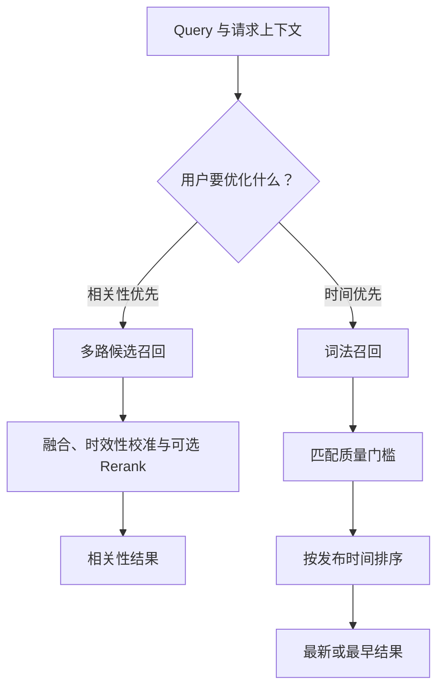
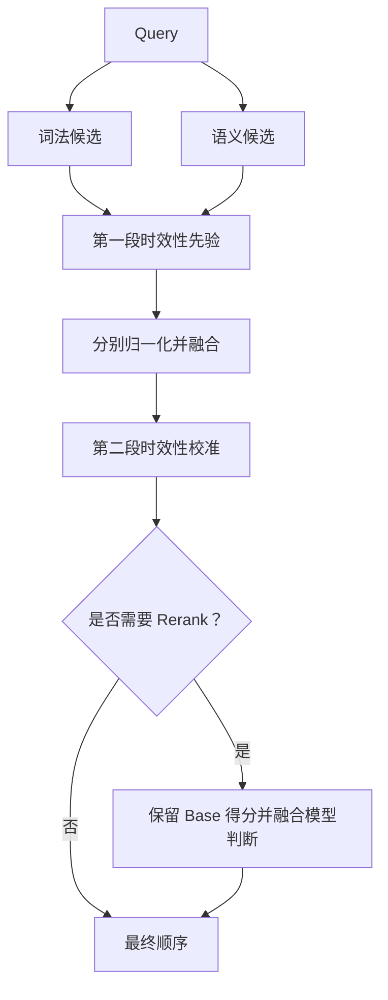
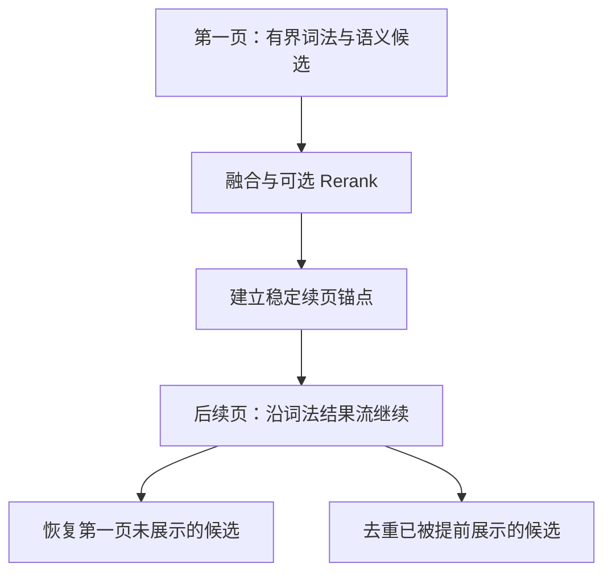
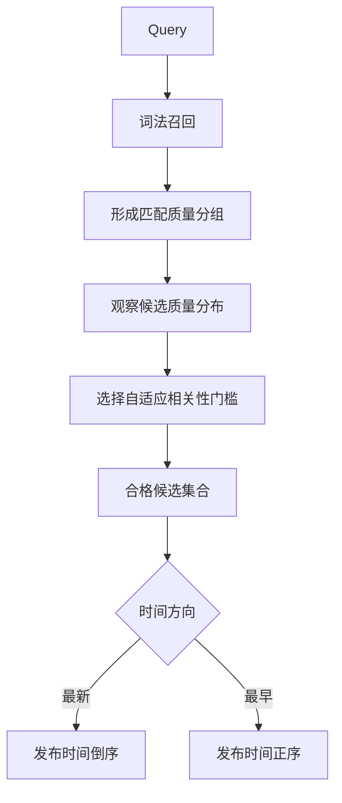

生产搜索不是“找一个更好的公式”，而是在目标、候选集合、时效性先验和昂贵模型之间连续做决定。真正困难的部分，往往不是某一步算得准不准，而是每一步应该看见哪些候选、改变什么，以及怎样让下一页仍然接得上。

本文不讨论某个具体系统的参数，而是整理一套可以迁移的多阶段搜索设计：相关性排序与时间排序为什么应该分流，复杂 Query 为什么是一种策略信号，为什么完整智能排序通常集中在第一页，以及时效性为什么需要在融合前后各出现一次。

<!-- more -->

<PostLanguageSwitch
  current="zh"
  english-path="/posts/multi-stage-search-ranking-en"
  chinese-path="/posts/multi-stage-search-ranking-zh"
/>

## 先选择目标，再讨论算法

搜索请求看起来都只有一个 Query，但用户可能在问两个完全不同的问题：

- “哪些内容最符合我的意图？”这是**相关性优先**。
- “与主题有关的内容里，哪些最新或最早？”这是**时间优先**。

这不是同一批候选换一个排序字段。相关性优先允许词法匹配、语义召回、融合和
Rerank 共同塑造顺序；时间优先则必须先建立相关性门槛，再让发布时间成为主
排序条件。否则，一篇刚发布但只擦到一个边的文章，会压过真正讨论这个主题的
内容。

先确定优化目标，后面的每一步才有明确语义。把两种目标硬塞进一条流水线，
通常会同时伤害可解释性和分页稳定性。

## 一张图看懂两条排序路径

这里最值得保留的抽象不是 BM25、向量模型或某个 Reranker，而是两条路径的
职责：

- 相关性路径负责比较“不同方式找到的候选”。
- 时间路径负责在“足够相关的候选”中比较时间。

算法可以替换，职责边界不应该随意移动。

## 复杂 Query 是策略信号，不是长度开关

**Q：复杂 Query 是不是“字数超过某个值”就算复杂？**

短答案：不是。长度只是信号之一，Complex 更适合被理解成一个**排序策略
分类**。

工程上可以综合观察三类公开信号：

1. **字符与书写形态**：不同文字系统的分词和精确匹配能力不同，不能假设空格
   总能可靠表达词边界。
2. **描述范围**：一个 Query 是在找明确对象，还是同时包含事件、地点、时间、
   关系等多个约束。
3. **已知对象例外**：看起来较长的机构名、人名或固定表达，可能依然是清晰的
   导航型意图。

因此，复杂度不应该直接等价于“开启语义召回”。它更像一个政策信号：系统可
据此选择更适合描述性意图的融合、时效性和 Rerank 策略。与此同时，明确的
导航型 Query、特殊词法规则或用户主动选择的检索模式，仍然可以改变实际召回
路径。

这种分层很重要：**Query 是什么**与**系统最终走哪条路线**是两个问题。把它们
合成一个布尔开关，会让特殊规则越来越难解释。

## 相关性路径：从候选到最终顺序

相关性排序的第一阶段不是排，而是找。词法召回擅长精确短语、实体和罕见词；
语义召回擅长表达不同但意思接近的内容。二者找到的候选会重叠，也会互相补足。

词法分数和语义分数不在同一个量纲上，直接相加没有稳定含义。更常见的做法是
先在各自候选通道内归一化，再按 Query 策略融合。融合得到的不是“真理分数”，
而是一个可继续校准的 Base 顺序。

后面的时效性、实体信号和 Rerank 都应该尊重一个原则：每一步只修正自己负责
的偏差，并保留前一阶段已经证明有用的信息。

## 为什么完整智能排序集中在第一页

**Q：既然 ANN、融合和 Rerank 更智能，为什么不在每一页都执行？**

短答案：首先是为了**分页连续性**，其次才是成本。

智能排序只能比较当前拿到的有限候选窗口。第一页里，某个原本较深的候选可能
被语义召回或 Rerank 提前；另一个候选也可能被降到窗口之外。如果第二页重新
取一个窗口并独立排序，就会出现三个问题：

- 第一页被降下去的候选可能永远消失；
- 第一页被提前展示的候选可能再次出现；
- 每翻一页，局部排序基准都变化，页边界持续漂移。

因此，一个稳健的设计通常把第一页看成“高质量橱窗”，把后续页看成“可恢复、
可去重的稳定续流”。后续页不是什么都不做，它仍然可以保留通道内相关性和
时效性，只是不再对每一页重新发明一个局部世界。

减少重复向量检索和模型调用当然能降低延迟与成本，但这是这个设计的副产品。
如果只用“省钱”解释第一页边界，就会漏掉真正的正确性约束。

## 为什么时效性要出现两次

**Q：已经在召回阶段考虑过新鲜度，为什么融合后还要再做一次？**

因为它们控制两个不同问题：

- **前段时效性**控制候选能否进入有限召回窗口。
- **后段时效性**控制不同召回通道合并后，候选之间怎样竞争。

只做前段时效性，新文章更容易进入各自通道，但独立归一化和融合权重可能稀释
这个效果；只做后段时效性，统一列表能得到清晰校准，却无法救回没有进入任何
候选窗口的文章。

| 设计 | 能解决什么 | 留下什么缺口 |
|---|---|---|
| 只有前段 | 让候选准入考虑新鲜度 | 融合后缺少统一校准 |
| 只有后段 | 让融合列表考虑新鲜度 | 无法恢复未被召回的内容 |
| 前后两段 | 同时控制候选可用性与融合后竞争 | 需要更清晰的分阶段配置和观测 |

两次出现不等于把同一个因子机械乘两遍。更好的做法是为两个阶段定义不同职责，
再按 Query 类型选择强弱：热点型意图可以更重视新鲜度，研究型或背景型意图则
需要给旧但高度相关的内容留下空间。

## Rerank 不是推倒重来

Rerank 擅长在一个较小候选集上理解更复杂的语义关系，但它也有成本、延迟和
失败概率。更关键的是，它看到的上下文与之前的检索证据并不相同。

因此，稳健的 Rerank 通常不是用模型分数完全替代 Base 顺序，而是把两者作为
不同证据进行校准和融合：

- Base 得分保留精确词法命中、语义相似度与时效性先验；
- 模型得分补充对整体 Query—文档关系的理解；
- 模型不可用时，系统仍能退回一条完整、可解释的结果链。

这也意味着 Rerank 应该有明确资格条件。导航型短 Query 往往不需要昂贵模型，
描述性、多约束 Query 才更可能从它受益。

## 时间排序也需要相关性门槛

时间优先不代表“从所有文章里选最新”。它的正确问题是：“在与 Query 足够
相关的文章中，哪些最新或最早？”

这里使用“质量分组 + 自适应门槛”，比一个固定分数更容易适应 Query 差异。
有的 Query 能产生大量高置信匹配，有的只能找到较弱但仍有价值的候选。门槛
先决定资格，时间再决定顺序；匹配质量只在必要时承担并列处理。

## 不同 Query 会走向哪里

拿到一个 Query 时，可以用下面的公开场景做第一轮推断：

| 场景 | 可能的主要路径 | 重点检查 |
|---|---|---|
| 空白或只有符号 | 校验失败或直接返回空集合 | 是否包含可搜索字符 |
| 短而明确的导航型 Query | 词法和精确匹配优先 | 是否命中一个清晰对象 |
| 多约束描述型 Query | 词法 + 语义，可能进入 Rerank | 语义候选是否补足表达差异 |
| 非拉丁文字或混合书写 Query | 取决于分词、字符形态与已知对象 | 不要用空格数量机械判断 |
| 用户明确选择词法模式 | 关闭语义候选，保留词法排序 | Rerank 是否仍有独立资格 |
| 精确 ID 或标题 | 常规排序加精确候选提升 | 最终是否去重 |
| 相关性后续页 | 稳定词法续流、恢复与去重 | 不应期待每页重新做全量智能排序 |
| 最新或最早 | 相关性准入后按时间排序 | 新或旧不能替代主题相关性 |

这张表不是路由配置，而是一个诊断索引。真正排查结果时，还要把排序目标、
分页状态、过滤条件和用户选项一起带入。

## 设计边界与常见误区

几个常见误区值得单独记住：

1. **把 Query 长度当成唯一复杂度标准。** 它会误伤长实体，也会低估没有空格
   的描述性输入。
2. **把 ANN 当成 BM25 的升级版。** 两者提供不同候选证据，语义召回并不天然
   更精确。
3. **认为 Rerank 可以修复所有召回问题。** 没进入候选集的文章，任何后处理
   都看不到。
4. **认为时间排序不需要相关性。** 这会把“最新的弱匹配”误当成“最新的相关
   内容”。
5. **逐页独立做智能排序。** 局部看更聪明，整体可能出现重复、遗漏和漂移。
6. **只看最终名次。** 更有效的排查顺序是：资格 → 召回来源 → Base 排序 →
   时效性 → Rerank → 最终提升或去重。

多阶段系统的可解释性不来自一个万能分数，而来自每个阶段都有清晰输入、输出
和失败回退。

## 结语

搜索排序的核心并不是堆更多模型，而是管理候选集合在每个边界上的变化：

- 目标决定主路径；
- Query 信号选择策略，但不替代路线判断；
- 前段时效性决定谁有资格参加；
- 融合让不同召回方式进入同一个竞争空间；
- 后段时效性与 Rerank 修正统一列表；
- 分页机制负责让第一页的智能排序不会破坏后续连续性。

当一个结果不符合预期时，最有用的问题不是“最终公式错了吗”，而是“它在哪个
阶段第一次偏离了预期”。能回答这个问题，系统才真正具备持续迭代的能力。
