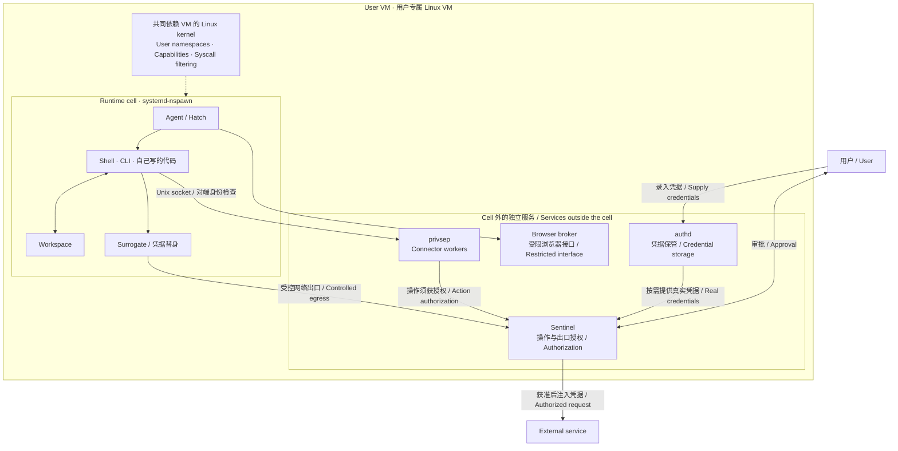

I read Meta’s [How We Built Safety Into Muse](https://research.meta.ai/blog/security-and-safety-for-ai-agents-our-approach-with-muse), and my first reaction was: there is a lot of Linux here.

Halfway through, I was chatting with a friend about how Meta sometimes puts effort into unexpected places. I had opened the article to see how they approached agent safety. Soon I was reading about user namespaces, privilege separation, and communication between processes.

A few details seemed worth writing down. The architecture diagram was particularly useful: it shows where the agent runs, where credentials live, and which component decides whether an operation may proceed.

The runtime cell and VM are the parts I wanted to understand better.

<!-- more -->

<PostLanguageSwitch current="en" english-path="/posts/muse-security-notes-en" chinese-path="/posts/muse-security-notes-zh" />

## Two boundaries to keep separate

Muse runs its agent environment inside a `systemd-nspawn` runtime cell, with credential and permission services outside it. Root inside the cell maps to an unprivileged user outside. [Muse Secure VM](https://research.meta.ai/blog/security-and-safety-for-ai-agents-our-approach-with-muse)

The diagram below expands that part of the design. It shows responsibilities rather than a complete call sequence, and leaves out inference and telemetry. Services outside the cell do not necessarily run as root.



“Host” can be confusing here. Relative to the container, the surrounding VM is the host. That does not mean the cloud provider’s physical machine. And `nspawn` does not introduce another independent kernel inside the VM.

## Where is this root?

My initial understanding was that the agent should stay in a guest environment instead of running with full host privileges.

There is a useful refinement: it can be root inside its environment without becoming root outside it.

Linux user namespaces support different UID mappings across the boundary. A process can see UID 0 internally while corresponding to an ordinary user externally. [User namespaces documentation](https://man7.org/linux/man-pages/man7/user_namespaces.7.html)

For example, using an arbitrary external UID:

```text
Inside the runtime cell: UID 0
                 │
                 │ UID mapping
                 ▼
On the VM host: UID 100000
```

That seems useful for agents. They need room to install tools and experiment, but do not need permission to rewrite the rules governing that environment.

Still, the container name is not a security guarantee. The `nspawn` documentation explicitly calls for user namespaces when running untrusted code. Mappings, mounts, and granted privileges all need inspection. [systemd-nspawn documentation](https://man7.org/linux/man-pages/man1/systemd-nspawn.1.html)

I used to associate these details mainly with operations work. Building agents makes them feel much closer to application development.

## I like the idea of substituting credentials

If an agent checks my calendar, it needs the ability to perform that operation. Knowing the literal API token contributes nothing to the task.

It is easy to implement an integration like this:

```text
Put an API key in an environment variable
        ↓
Let the tool read it
        ↓
Call the external service
```

But an environment variable may not be secret from an agent that can execute shell commands. Keeping a key out of the prompt does not establish that the agent cannot retrieve it.

I prefer separating the responsibilities:

```text
Agent: request an operation using an account
        ↓
Authorization: decide whether it is allowed
        ↓
Credential component: supply authentication where needed
```

The same idea applies to browser login. An agent may need to work in an authenticated session without needing to know the password.

**Using an account and knowing its secrets can be separate capabilities.**

Business data needs a different treatment. An agent usually does not need to understand a password, but it does need an email’s contents to summarize it.

I would therefore ask two separate questions: does the agent need to read this information, and may it send that information somewhere else?

Hiding credentials does not, by itself, protect every document the agent can access.

## It reminds me of a separation of powers

That was my immediate association while reading.

Not a literal mapping to political institutions—just the separation between doing work, holding credentials, and approving operations.

If an agent can execute tasks, modify authorization rules, and read every credential, a great deal depends on it choosing to behave correctly. Separating those powers means the component doing the work cannot simply approve itself.

Splitting code into modules is not enough, though. If the agent can modify the approval service or inspect the credential process, the separation may exist only in the source tree.

This is where the Linux mechanisms become relevant:

|Mechanism|What I want to check|
|---|---|
|User namespaces|How identities map across the boundary|
|Capabilities|Which privileged operations remain available|
|System-call filtering|Which kernel interfaces the process can use|
|Unix socket peer identity|Which process actually sent the request|

These cover identity mapping, individual privileges, system-call restrictions, and kernel-supplied peer information. [Capabilities](https://man7.org/linux/man-pages/man7/capabilities.7.html), [seccomp](https://man7.org/linux/man-pages/man2/seccomp.2.html), [Unix sockets](https://man7.org/linux/man-pages/man7/unix.7.html)

While discussing the article, I said something like: if the agent cannot control it, it cannot break the permission boundary.

That was too absolute. Removing administrative access takes away authority the agent would otherwise possess. Bugs in the kernel, interfaces, or authorization logic remain another problem.

And even without seeing a token, an agent can misuse an authorized tool. Credential isolation and action authorization both matter.

## A few things to learn next

I want to look more closely at `nspawn` mappings and mounts, identity checks across process boundaries, the permitted scope of credential references, and whether outbound restrictions still hold when an agent uses a different network client.

I have not built or tested this setup myself. These are notes for further study.

In an earlier post about Vibe Coding, I wrote that stronger AI coding tools make our own understanding of code and architecture more important. Reading this article brought back that thought.

An agent can write plenty of code. We still need to understand where that code runs, what it can access, and what can stop it when something goes wrong.

More Linux to learn.
