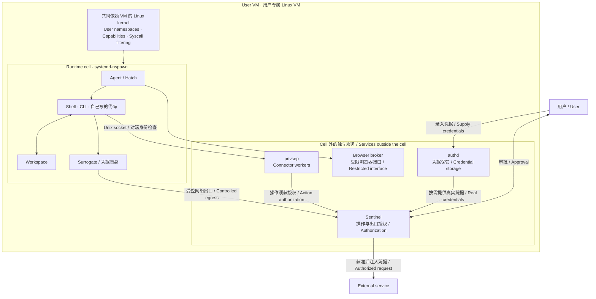

看了 Meta 的 [How We Built Safety Into Muse](https://research.meta.ai/blog/security-and-safety-for-ai-agents-our-approach-with-muse)，第一感觉是：好多 Linux 的知识。

看到一半和朋友聊，觉得 Meta 总是在一些奇奇怪怪的地方发力。原本只是想看看 agent 的安全怎么做，结果读到了用户命名空间、权限隔离、进程间通信，专业性突然拉满了。

有几个地方值得记下来。尤其是它的架构图，把 agent 放在哪里、凭据放在哪里、谁来决定操作能不能执行，交代得很清楚。

我自己最感兴趣的是 runtime cell 和 VM 这一部分。

<!-- more -->

<PostLanguageSwitch current="zh" english-path="/posts/muse-security-notes-en" chinese-path="/posts/muse-security-notes-zh" />

## 先分清楚这两层

按原文，Muse 的 agent 工作在 `systemd-nspawn` runtime cell 里，凭据和权限管理则放在 cell 外。容器内的 root 映射为外部的非特权用户。[原文：Muse Secure VM](https://research.meta.ai/blog/security-and-safety-for-ai-agents-our-approach-with-muse)

下面把这部分单独展开。图里主要画权限关系，省略推理、遥测等路径。



*根据原文重新组织的局部示意图。箭头不是完整调用时序；cell 外的服务也不意味着都以 root 身份运行。*

这里容易看混的是 host。

相对于 runtime cell，外面的 VM 环境就是 host；它仍然是云上的一台虚拟机，不是物理宿主机。`nspawn` 也没有在 VM 里面再启动一个独立内核，两层边界不能混为一谈。

## `root` 这个名字，要看它在哪

我一开始的理解是：不能把 agent 做成一个拥有顶级权限的 host agent，应该让它待在 guest 里。

往下看，发现还可以更准确一点：它在里面可以是 root，但这个 root 的作用范围受限。

Linux user namespace 允许内外使用不同的 UID 映射。一个进程在里面看到自己是 UID 0，在外面可以只是普通用户。[user_namespaces 文档](https://man7.org/linux/man-pages/man7/user_namespaces.7.html)

举个例子，具体 UID 是随便写的：

```text
Runtime cell 内：UID 0
          │
          │ 用户命名空间映射
          ▼
VM host 上：UID 100000
```

这样 agent 在自己的环境里仍然可以做很多事情，但不会因为拿到了里面的 root，就顺便获得整个 VM 的管理权限。

这个设计对 agent 很合适。它需要能折腾的工作环境，但没有必要能改自己的权限规则。

不过，`nspawn` 这个名字本身不是安全保证。它的文档明确提醒，运行不可信代码需要使用 user namespace。配置了哪些映射、挂载了什么、给了什么权限，还是得逐项看。[systemd-nspawn 文档](https://man7.org/linux/man-pages/man1/systemd-nspawn.1.html)

以前可能会觉得这些是偏运维的知识，现在做 agent 也绕不过去了。

## 凭据替换这个思路，我觉得很好

假设 agent 要帮我查日历，它需要的是“查日历”这个能力。至于 API token 长什么样，其实和它完成任务没有关系。

我们很容易写成：

```text
把 API key 放进环境变量
        ↓
工具读取 key
        ↓
请求外部服务
```

对于能运行 shell 的 agent，环境变量未必是什么秘密。就算没有直接写进 prompt，也得考虑它能不能通过工具读出来。

我更喜欢这种分工：

```text
Agent：
我要用某个账号执行这个操作
        ↓
权限检查：
这个操作是否允许？
        ↓
凭据模块：
在需要认证的位置使用真实凭据
```

浏览器登录也是类似的想法。agent 需要完成登录后的任务，不代表密码必须先经过它。

**能用一个账号，和知道这个账号的秘密，可以分开。**

这也让我重新理解“数据隔离”。凭据、密码这些内容，agent 通常不需要理解，可以尽量不让它看见。但邮件、文档这些业务数据不一样，让它总结一封邮件，总不能连邮件都不给它读。

所以这里至少有两个问题：

1. 这份数据是否需要让 agent 看见？
2. 看见之后，是否允许它发到另一个地方？

允许读，不应该顺带变成允许向任何地方发送。凭据藏好了，也不代表业务数据就不会泄露，这两件事需要分别处理。

## 有点“三权分立”的感觉

我看到这里的时候，脑子里冒出来的就是这个词。

不是说组件可以和政治制度一一对应，而是做事、保管凭据、批准操作这几件事，被拆开了。

如果一个 agent 既能执行任务，又能修改授权规则，还能读取所有凭据，那前面写多少“请遵守规则”，最后都得指望它自己遵守。

分开以后，至少可以要求：做事的那个组件，没有权限给自己开绿灯。

当然，拆成几个模块还不够。如果它们共享同样的高权限，agent 能修改审批代码或者读取凭据进程的内存，分工也就只是代码组织上的分工。

这时候 Linux 那些东西就有用了：

|机制|我会先关注什么|
|---|---|
|User namespace|里面的身份，在外面对应谁|
|Capabilities|除了 UID，还保留了哪些特权能力|
|系统调用过滤|进程还能调用哪些内核接口|
|Unix socket 对端身份|请求到底来自哪个进程，不能只听它自己报名字|

这些机制分别涉及身份映射、特权拆分、系统调用限制和内核提供的进程身份信息。[Capabilities](https://man7.org/linux/man-pages/man7/capabilities.7.html)、[seccomp](https://man7.org/linux/man-pages/man2/seccomp.2.html)、[Unix sockets](https://man7.org/linux/man-pages/man7/unix.7.html)

我当时说“管不到就不会发生权限突破”，现在觉得这句话还是有点说满了。

更准确的理解是：先把它正常情况下就能拿到的管理权收掉。至于内核、接口或者权限检查有没有漏洞，仍然是另一层需要解决的问题。

还有一点：拿不到真实 token，也可能通过合法工具做错事。所以**凭据隔离和操作授权缺一不可**。

## 记几个后面值得学的点

这篇文章让我想继续看的，主要是：

- `nspawn` 的 user namespace 和文件挂载怎么配，什么配置会把隔离重新打穿。
- 跨进程调用时，身份检查和具体权限检查分别放在哪里。
- 凭据替身怎么绑定使用范围，复制到其他地方还能不能用。
- 网络出口怎么限制，agent 换一个客户端是不是仍然受控。

这些我还没有自己搭环境验证，先记下来。

以前写 Vibe Coding 的实践总结时，我记过一句话：AI 辅助编程越强大，理解代码和架构的能力就越重要。读这篇文章，又有点同样的感觉。

agent 可以帮我们写很多代码，但这些代码运行在哪里，能接触哪些数据，出了问题谁能拦住它，还是需要自己想清楚。

得学一学 Linux 了。
